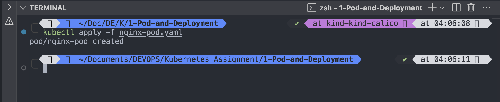
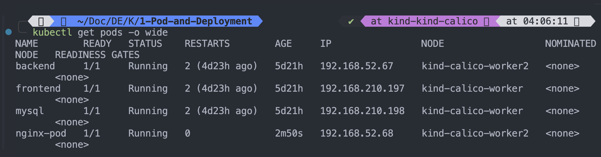
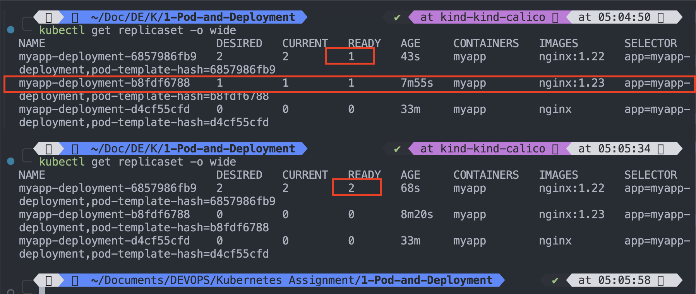

# Create nginx pod

```sh
touch nginx_pod.yaml
```

```yaml
apiVersion: v1
kind: Pod
metadata:
  name: nginx-container
  labels:
    name: nginx-pod
    env: test
spec:
  containers:
    - name: nginx-container
      image: nginx
      ports:
        comtainerPort: 80
```

```sh
kubectl apply -f nginx-pod.yaml
```

`Output:`

```sh
kubectl apply -f nginx-pod.yaml
pod/nginx-pod created
```



---

```sh
kubectl get pods -o wide
```

`Output`

```sh
kubectl get pods -o wide
NAME        READY   STATUS    RESTARTS        AGE     IP                NODE                  NOMINATED NODE   READINESS GATES
backend     1/1     Running   2 (4d23h ago)   5d21h   192.168.52.67     kind-calico-worker2   <none>           <none>
frontend    1/1     Running   2 (4d23h ago)   5d21h   192.168.210.197   kind-calico-worker    <none>           <none>
mysql       1/1     Running   2 (4d23h ago)   5d21h   192.168.210.198   kind-calico-worker    <none>           <none>
nginx-pod   1/1     Running   0               2m50s   192.168.52.68     kind-calico-worker2   <none>           <none>
```



---

# Observe the pod

```sh
kubectl describe pod/nginx-pod
```

`Output:`

```sh
kubectl describe pod/nginx-pod
Name:             nginx-pod
Namespace:        default
Priority:         0
Service Account:  default
Node:             kind-calico-worker2/172.19.0.6
Start Time:       Tue, 25 Feb 2025 04:06:11 +0530
Labels:           env=test
                  name=nginx-pod
Annotations:      cni.projectcalico.org/containerID: 6b3518fe560e866a4403c23b91389dcbe5e84c71b48e948700aa3567bf8b482d
                  cni.projectcalico.org/podIP: 192.168.52.68/32
                  cni.projectcalico.org/podIPs: 192.168.52.68/32
Status:           Running
IP:               192.168.52.68
IPs:
  IP:  192.168.52.68
Containers:
  nginx-container:
    Container ID:   containerd://b13e1ecb2fe0edadb64faa45be722ffcb1df8a86344e4ec43cf7bcdbea9a5f99
    Image:          nginx
    Image ID:       docker.io/library/nginx@sha256:91734281c0ebfc6f1aea979cffeed5079cfe786228a71cc6f1f46a228cde6e34
    Port:           80/TCP
    Host Port:      0/TCP
    State:          Running
      Started:      Tue, 25 Feb 2025 04:06:16 +0530
    Ready:          True
    Restart Count:  0
    Environment:    <none>
    Mounts:
      /var/run/secrets/kubernetes.io/serviceaccount from kube-api-access-l2wg4 (ro)
Conditions:
  Type                        Status
  PodReadyToStartContainers   True
  Initialized                 True
  Ready                       True
  ContainersReady             True
  PodScheduled                True
Volumes:
  kube-api-access-l2wg4:
    Type:                    Projected (a volume that contains injected data from multiple sources)
    TokenExpirationSeconds:  3607
    ConfigMapName:           kube-root-ca.crt
    ConfigMapOptional:       <nil>
    DownwardAPI:             true
QoS Class:                   BestEffort
Node-Selectors:              <none>
Tolerations:                 node.kubernetes.io/not-ready:NoExecute op=Exists for 300s
                             node.kubernetes.io/unreachable:NoExecute op=Exists for 300s
Events:
  Type    Reason     Age    From               Message
  ----    ------     ----   ----               -------
  Normal  Scheduled  5m1s   default-scheduler  Successfully assigned default/nginx-pod to kind-calico-worker2
  Normal  Pulling    4m59s  kubelet            Pulling image "nginx"
  Normal  Pulled     4m57s  kubelet            Successfully pulled image "nginx" in 2.741s (2.741s including waiting). Image size: 68631146 bytes.
  Normal  Created    4m57s  kubelet            Created container: nginx-container
  Normal  Started    4m56s  kubelet            Started container nginx-container
```

---

# Create nginx deployment with 2 replicas

```sh
vim nginx-deployment.yaml
```

```yaml
apiVersion: apps/v1
kind: Deployment
metadata:
  name: nginx-deployment
  labels:
    app: nginx-deployment
    env: test
spec:
  replicas: 2
  selector:
    matchLabels:
      app: nginx-deployment
  template:
    metadata:
      name: nginx-deployment
      labels:
        app: nginx-deployment
        env: test
    spec:
      containers:
        - name: nginx-container
          image: nginx
          resources:
            limits:
              memory: "128Mi"
              cpu: "500m"
          ports:
            - containerPort: 80
```

---

```sh
kubectl apply -f nginx-deployment.yaml
```

`Output:`

```sh
kubectl apply -f nginx-deployment.yaml
deployment.apps/myapp-deployment created
```

---

# List deployments

```sh
kubectl get deploy
```

`Output:`

```sh
kubectl get deploy
NAME               READY   UP-TO-DATE   AVAILABLE   AGE
myapp-deployment   2/2     2            2           95s
```

---

# Describe deployment pod

```sh
kubectl get pods -o wide
```

`Output:`

```sh
kubectl get pods -o wide
NAME                               READY   STATUS    RESTARTS        AGE     IP                NODE                  NOMINATED NODE   READINESS GATES
backend                            1/1     Running   2 (4d23h ago)   5d22h   192.168.52.67     kind-calico-worker2   <none>           <none>
frontend                           1/1     Running   2 (4d23h ago)   5d22h   192.168.210.197   kind-calico-worker    <none>           <none>
myapp-deployment-d4cf55cfd-jjg4s   1/1     Running   0               3m15s   192.168.210.199   kind-calico-worker    <none>           <none>
myapp-deployment-d4cf55cfd-ktcjc   1/1     Running   0               3m15s   192.168.52.69     kind-calico-worker2   <none>           <none>
mysql                              1/1     Running   2 (4d23h ago)   5d22h   192.168.210.198   kind-calico-worker    <none>           <none>
nginx-pod                          1/1     Running   0               29m     192.168.52.68     kind-calico-worker2   <none>           <none>
```

---

# describe nginx-deployment pod

```sh
kubectl describe deploy/myapp-deployment
```

`Output:`

```sh
kubectl describe deploy/myapp-deployment
Name:                   myapp-deployment
Namespace:              default
CreationTimestamp:      Tue, 25 Feb 2025 04:32:19 +0530
Labels:                 app=nginx-deployment
                        env=test
Annotations:            deployment.kubernetes.io/revision: 1
Selector:               app=myapp-deployment
Replicas:               2 desired | 2 updated | 2 total | 2 available | 0 unavailable
StrategyType:           RollingUpdate
MinReadySeconds:        0
RollingUpdateStrategy:  25% max unavailable, 25% max surge
Pod Template:
  Labels:  app=myapp-deployment
  Containers:
   myapp:
    Image:      nginx
    Port:       80/TCP
    Host Port:  0/TCP
    Limits:
      cpu:         500m
      memory:      128Mi
    Environment:   <none>
    Mounts:        <none>
  Volumes:         <none>
  Node-Selectors:  <none>
  Tolerations:     <none>
Conditions:
  Type           Status  Reason
  ----           ------  ------
  Available      True    MinimumReplicasAvailable
  Progressing    True    NewReplicaSetAvailable
OldReplicaSets:  <none>
NewReplicaSet:   myapp-deployment-d4cf55cfd (2/2 replicas created)
Events:
  Type    Reason             Age    From                   Message
  ----    ------             ----   ----                   -------
  Normal  ScalingReplicaSet  5m31s  deployment-controller  Scaled up replica set myapp-deployment-d4cf55cfd from 0 to 2
```

---

```sh
kubectl get pods
```

`Outputs:`

```sh
kubectl get pods
NAME                               READY   STATUS    RESTARTS        AGE
backend                            1/1     Running   2 (4d23h ago)   5d22h
frontend                           1/1     Running   2 (4d23h ago)   5d22h
myapp-deployment-d4cf55cfd-jjg4s   1/1     Running   0               9m8s
myapp-deployment-d4cf55cfd-ktcjc   1/1     Running   0               9m8s
mysql                              1/1     Running   2 (4d23h ago)   5d22h
nginx-pod                          1/1     Running   0               35m

```

```sh
kubectl delete deploy/myapp-deployment
```

# Edit the Deployment Manually

- Find the image field under spec.template.spec.containers.
- Change it to the new image, save, and exit the editor.

```sh
kubectl edit deployment/myapp-deployment
```

`Output:`

```sh
kubectl edit deployment/myapp-deployment
Edit cancelled, no changes made.
```

OR

```sh
kubectl set image deploy/myapp-deployment myapp=nginx:1.23
```

`Output:`

```sh
kubectl set image deploy/myapp-deployment myapp=nginx:1.23
deployment.apps/myapp-deployment image updated
```

---

```sh
kubectl describe deploy/myapp-deployment
```

`Output:`

```sh
kubectl describe deploy/myapp-deployment
Name:                   myapp-deployment
Namespace:              default
CreationTimestamp:      Tue, 25 Feb 2025 04:32:19 +0530
Labels:                 app=nginx-deployment
                        env=test
Annotations:            deployment.kubernetes.io/revision: 2
Selector:               app=myapp-deployment
Replicas:               2 desired | 2 updated | 2 total | 2 available | 0 unavailable
StrategyType:           RollingUpdate
MinReadySeconds:        0
RollingUpdateStrategy:  25% max unavailable, 25% max surge
Pod Template:
  Labels:  app=myapp-deployment
  Containers:
   myapp:
    Image:      nginx:1.23
    Port:       80/TCP
    Host Port:  0/TCP
    Limits:
      cpu:         500m
      memory:      128Mi
    Environment:   <none>
    Mounts:        <none>
  Volumes:         <none>
  Node-Selectors:  <none>
  Tolerations:     <none>
Conditions:
  Type           Status  Reason
  ----           ------  ------
  Available      True    MinimumReplicasAvailable
  Progressing    True    NewReplicaSetAvailable
OldReplicaSets:  myapp-deployment-d4cf55cfd (0/0 replicas created)
NewReplicaSet:   myapp-deployment-b8fdf6788 (2/2 replicas created)
Events:
  Type    Reason             Age   From                   Message
  ----    ------             ----  ----                   -------
  Normal  ScalingReplicaSet  26m   deployment-controller  Scaled up replica set myapp-deployment-d4cf55cfd from 0 to 2
  Normal  ScalingReplicaSet  77s   deployment-controller  Scaled up replica set myapp-deployment-b8fdf6788 from 0 to 1
  Normal  ScalingReplicaSet  58s   deployment-controller  Scaled down replica set myapp-deployment-d4cf55cfd from 2 to 1
  Normal  ScalingReplicaSet  58s   deployment-controller  Scaled up replica set myapp-deployment-b8fdf6788 from 1 to 2
  Normal  ScalingReplicaSet  39s   deployment-controller  Scaled down replica set myapp-deployment-d4cf55cfd from 1 to 0
```

---

```sh
kubectl get rs
```

Or

```sh
kubectl get replicaset -o wide
```

`Output:`

```sh
kubectl get rs -o wide
NAME                         DESIRED   CURRENT   READY   AGE     CONTAINERS   IMAGES       SELECTOR
myapp-deployment-b8fdf6788   2         2         2       4m16s   myapp        nginx:1.23   app=myapp-deployment,pod-template-hash=b8fdf6788
myapp-deployment-d4cf55cfd   0         0         0       29m     myapp        nginx        app=myapp-deployment,pod-template-hash=d4cf55cfd

```

---

```sh
kubectl set image deploy/myapp-deployment myapp=nginx:1.22
```

```sh
kubectl get rs
```

`Output:`

```sh
kubectl get replicaset -o wide
NAME                          DESIRED   CURRENT   READY   AGE     CONTAINERS   IMAGES       SELECTOR
myapp-deployment-6857986fb9   2         2         1       43s     myapp        nginx:1.22   app=myapp-deployment,pod-template-hash=6857986fb9
myapp-deployment-b8fdf6788    1         1         1       7m55s   myapp        nginx:1.23   app=myapp-deployment,pod-template-hash=b8fdf6788
myapp-deployment-d4cf55cfd    0         0         0       33m     myapp        nginx        app=myapp-deployment,pod-template-hash=d4cf55cfd

```

```sh
kubectl get replicaset -o wide
NAME                          DESIRED   CURRENT   READY   AGE     CONTAINERS   IMAGES       SELECTOR
myapp-deployment-6857986fb9   2         2         2       68s     myapp        nginx:1.22   app=myapp-deployment,pod-template-hash=6857986fb9
myapp-deployment-b8fdf6788    0         0         0       8m20s   myapp        nginx:1.23   app=myapp-deployment,pod-template-hash=b8fdf6788
myapp-deployment-d4cf55cfd    0         0         0       33m     myapp        nginx        app=myapp-deployment,pod-template-hash=d4cf55cfd
```

## 

# Change the replica to 1 and observe the pods

```sh
kubectl scale --replicas=1 deploy/myapp-deployment
```

`Output:`

```sh
kubectl scale --replicas=1 deploy/myapp-deployment
deployment.apps/myapp-deployment scaled
```

---

```sh
kubectl describe deploy/myapp-deployment
```

`Output:`

```sh
kubectl describe deploy/myapp-deployment
Name:                   myapp-deployment
Namespace:              default
CreationTimestamp:      Tue, 25 Feb 2025 04:32:19 +0530
Labels:                 app=nginx-deployment
                        env=test
Annotations:            deployment.kubernetes.io/revision: 3
Selector:               app=myapp-deployment
Replicas:               1 desired | 1 updated | 1 total | 1 available | 0 unavailable
StrategyType:           RollingUpdate
MinReadySeconds:        0
RollingUpdateStrategy:  25% max unavailable, 25% max surge
Pod Template:
  Labels:  app=myapp-deployment
  Containers:
   myapp:
    Image:      nginx:1.22
    Port:       80/TCP
    Host Port:  0/TCP
    Limits:
      cpu:         500m
      memory:      128Mi
    Environment:   <none>
    Mounts:        <none>
  Volumes:         <none>
  Node-Selectors:  <none>
  Tolerations:     <none>
Conditions:
  Type           Status  Reason
  ----           ------  ------
  Available      True    MinimumReplicasAvailable
  Progressing    True    NewReplicaSetAvailable
OldReplicaSets:  myapp-deployment-d4cf55cfd (0/0 replicas created), myapp-deployment-b8fdf6788 (0/0 replicas created)
NewReplicaSet:   myapp-deployment-6857986fb9 (1/1 replicas created)
Events:
  Type    Reason             Age    From                   Message
  ----    ------             ----   ----                   -------
  Normal  ScalingReplicaSet  37m    deployment-controller  Scaled up replica set myapp-deployment-d4cf55cfd from 0 to 2
  Normal  ScalingReplicaSet  12m    deployment-controller  Scaled up replica set myapp-deployment-b8fdf6788 from 0 to 1
  Normal  ScalingReplicaSet  11m    deployment-controller  Scaled down replica set myapp-deployment-d4cf55cfd from 2 to 1
  Normal  ScalingReplicaSet  11m    deployment-controller  Scaled up replica set myapp-deployment-b8fdf6788 from 1 to 2
  Normal  ScalingReplicaSet  11m    deployment-controller  Scaled down replica set myapp-deployment-d4cf55cfd from 1 to 0
  Normal  ScalingReplicaSet  4m51s  deployment-controller  Scaled up replica set myapp-deployment-6857986fb9 from 0 to 1
  Normal  ScalingReplicaSet  4m30s  deployment-controller  Scaled down replica set myapp-deployment-b8fdf6788 from 2 to 1
  Normal  ScalingReplicaSet  4m29s  deployment-controller  Scaled up replica set myapp-deployment-6857986fb9 from 1 to 2
  Normal  ScalingReplicaSet  4m1s   deployment-controller  Scaled down replica set myapp-deployment-b8fdf6788 from 1 to 0
  Normal  ScalingReplicaSet  6s     deployment-controller  Scaled down replica set myapp-deployment-6857986fb9 from 2 to 1

```

---

# Change the replicas to 3 and observe the pods

```sh
╰─ kubectl scale --replicas=3 deploy/myapp-deployment
```

`Output:`

```sh
kubectl scale --replicas=3 deploy/myapp-deployment
deployment.apps/myapp-deployment scaled
```

---

```sh
kubectl describe deploy/myapp-deployment
```

`Output:`

```sh
kubectl describe deploy/myapp-deployment
Name:                   myapp-deployment
Namespace:              default
CreationTimestamp:      Tue, 25 Feb 2025 04:32:19 +0530
Labels:                 app=nginx-deployment
                        env=test
Annotations:            deployment.kubernetes.io/revision: 3
Selector:               app=myapp-deployment
Replicas:               3 desired | 3 updated | 3 total | 1 available | 2 unavailable
StrategyType:           RollingUpdate
MinReadySeconds:        0
RollingUpdateStrategy:  25% max unavailable, 25% max surge
Pod Template:
  Labels:  app=myapp-deployment
  Containers:
   myapp:
    Image:      nginx:1.22
    Port:       80/TCP
    Host Port:  0/TCP
    Limits:
      cpu:         500m
      memory:      128Mi
    Environment:   <none>
    Mounts:        <none>
  Volumes:         <none>
  Node-Selectors:  <none>
  Tolerations:     <none>
Conditions:
  Type           Status  Reason
  ----           ------  ------
  Progressing    True    NewReplicaSetAvailable
  Available      False   MinimumReplicasUnavailable
OldReplicaSets:  myapp-deployment-d4cf55cfd (0/0 replicas created), myapp-deployment-b8fdf6788 (0/0 replicas created)
NewReplicaSet:   myapp-deployment-6857986fb9 (3/3 replicas created)
Events:
  Type    Reason             Age   From                   Message
  ----    ------             ----  ----                   -------
  Normal  ScalingReplicaSet  43m   deployment-controller  Scaled up replica set myapp-deployment-d4cf55cfd from 0 to 2
  Normal  ScalingReplicaSet  18m   deployment-controller  Scaled up replica set myapp-deployment-b8fdf6788 from 0 to 1
  Normal  ScalingReplicaSet  17m   deployment-controller  Scaled down replica set myapp-deployment-d4cf55cfd from 2 to 1
  Normal  ScalingReplicaSet  17m   deployment-controller  Scaled up replica set myapp-deployment-b8fdf6788 from 1 to 2
  Normal  ScalingReplicaSet  17m   deployment-controller  Scaled down replica set myapp-deployment-d4cf55cfd from 1 to 0
  Normal  ScalingReplicaSet  10m   deployment-controller  Scaled up replica set myapp-deployment-6857986fb9 from 0 to 1
  Normal  ScalingReplicaSet  10m   deployment-controller  Scaled down replica set myapp-deployment-b8fdf6788 from 2 to 1
  Normal  ScalingReplicaSet  10m   deployment-controller  Scaled up replica set myapp-deployment-6857986fb9 from 1 to 2
  Normal  ScalingReplicaSet  10m   deployment-controller  Scaled down replica set myapp-deployment-b8fdf6788 from 1 to 0
  Normal  ScalingReplicaSet  6m5s  deployment-controller  Scaled down replica set myapp-deployment-6857986fb9 from 2 to 1
  Normal  ScalingReplicaSet  2s    deployment-controller  (combined from similar events): Scaled up replica set myapp-deployment-6857986fb9 from 1 to 3

```

```sh
kubectl describe deploy/myapp-deployment
```

`Output:`

```sh
kubectl describe deploy/myapp-deployment
Name:                   myapp-deployment
Namespace:              default
CreationTimestamp:      Tue, 25 Feb 2025 04:32:19 +0530
Labels:                 app=nginx-deployment
                        env=test
Annotations:            deployment.kubernetes.io/revision: 3
Selector:               app=myapp-deployment
Replicas:               3 desired | 3 updated | 3 total | 2 available | 1 unavailable
StrategyType:           RollingUpdate
MinReadySeconds:        0
RollingUpdateStrategy:  25% max unavailable, 25% max surge
Pod Template:
  Labels:  app=myapp-deployment
  Containers:
   myapp:
    Image:      nginx:1.22
    Port:       80/TCP
    Host Port:  0/TCP
    Limits:
      cpu:         500m
      memory:      128Mi
    Environment:   <none>
    Mounts:        <none>
  Volumes:         <none>
  Node-Selectors:  <none>
  Tolerations:     <none>
Conditions:
  Type           Status  Reason
  ----           ------  ------
  Progressing    True    NewReplicaSetAvailable
  Available      False   MinimumReplicasUnavailable
OldReplicaSets:  myapp-deployment-d4cf55cfd (0/0 replicas created), myapp-deployment-b8fdf6788 (0/0 replicas created)
NewReplicaSet:   myapp-deployment-6857986fb9 (3/3 replicas created)
Events:
  Type    Reason             Age    From                   Message
  ----    ------             ----   ----                   -------
  Normal  ScalingReplicaSet  43m    deployment-controller  Scaled up replica set myapp-deployment-d4cf55cfd from 0 to 2
  Normal  ScalingReplicaSet  18m    deployment-controller  Scaled up replica set myapp-deployment-b8fdf6788 from 0 to 1
  Normal  ScalingReplicaSet  17m    deployment-controller  Scaled down replica set myapp-deployment-d4cf55cfd from 2 to 1
  Normal  ScalingReplicaSet  17m    deployment-controller  Scaled up replica set myapp-deployment-b8fdf6788 from 1 to 2
  Normal  ScalingReplicaSet  17m    deployment-controller  Scaled down replica set myapp-deployment-d4cf55cfd from 1 to 0
  Normal  ScalingReplicaSet  11m    deployment-controller  Scaled up replica set myapp-deployment-6857986fb9 from 0 to 1
  Normal  ScalingReplicaSet  10m    deployment-controller  Scaled down replica set myapp-deployment-b8fdf6788 from 2 to 1
  Normal  ScalingReplicaSet  10m    deployment-controller  Scaled up replica set myapp-deployment-6857986fb9 from 1 to 2
  Normal  ScalingReplicaSet  10m    deployment-controller  Scaled down replica set myapp-deployment-b8fdf6788 from 1 to 0
  Normal  ScalingReplicaSet  6m15s  deployment-controller  Scaled down replica set myapp-deployment-6857986fb9 from 2 to 1
  Normal  ScalingReplicaSet  12s    deployment-controller  (combined from similar events): Scaled up replica set myapp-deployment-6857986fb9 from 1 to 3
```

# Change the replicas to 0 and observe the pods

```sh
kubectl scale --replicas=0 deploy/myapp-deployment
```

`Output:`

```sh
kubectl scale --replicas=0 deploy/myapp-deployment
deployment.apps/myapp-deployment scaled
```

---

```sh
kubectl describe deploy/myapp-deployment
```

`Output:`

```sh
kubectl describe deploy/myapp-deployment
Name:                   myapp-deployment
Namespace:              default
CreationTimestamp:      Tue, 25 Feb 2025 04:32:19 +0530
Labels:                 app=nginx-deployment
                        env=test
Annotations:            deployment.kubernetes.io/revision: 3
Selector:               app=myapp-deployment
Replicas:               0 desired | 0 updated | 0 total | 0 available | 0 unavailable
StrategyType:           RollingUpdate
MinReadySeconds:        0
RollingUpdateStrategy:  25% max unavailable, 25% max surge
Pod Template:
  Labels:  app=myapp-deployment
  Containers:
   myapp:
    Image:      nginx:1.22
    Port:       80/TCP
    Host Port:  0/TCP
    Limits:
      cpu:         500m
      memory:      128Mi
    Environment:   <none>
    Mounts:        <none>
  Volumes:         <none>
  Node-Selectors:  <none>
  Tolerations:     <none>
Conditions:
  Type           Status  Reason
  ----           ------  ------
  Progressing    True    NewReplicaSetAvailable
  Available      True    MinimumReplicasAvailable
OldReplicaSets:  myapp-deployment-d4cf55cfd (0/0 replicas created), myapp-deployment-b8fdf6788 (0/0 replicas created)
NewReplicaSet:   myapp-deployment-6857986fb9 (0/0 replicas created)
Events:
  Type    Reason             Age                 From                   Message
  ----    ------             ----                ----                   -------
  Normal  ScalingReplicaSet  46m                 deployment-controller  Scaled up replica set myapp-deployment-d4cf55cfd from 0 to 2
  Normal  ScalingReplicaSet  21m                 deployment-controller  Scaled up replica set myapp-deployment-b8fdf6788 from 0 to 1
  Normal  ScalingReplicaSet  20m                 deployment-controller  Scaled down replica set myapp-deployment-d4cf55cfd from 2 to 1
  Normal  ScalingReplicaSet  20m                 deployment-controller  Scaled up replica set myapp-deployment-b8fdf6788 from 1 to 2
  Normal  ScalingReplicaSet  20m                 deployment-controller  Scaled down replica set myapp-deployment-d4cf55cfd from 1 to 0
  Normal  ScalingReplicaSet  14m                 deployment-controller  Scaled up replica set myapp-deployment-6857986fb9 from 0 to 1
  Normal  ScalingReplicaSet  13m                 deployment-controller  Scaled down replica set myapp-deployment-b8fdf6788 from 2 to 1
  Normal  ScalingReplicaSet  13m                 deployment-controller  Scaled up replica set myapp-deployment-6857986fb9 from 1 to 2
  Normal  ScalingReplicaSet  13m                 deployment-controller  Scaled down replica set myapp-deployment-b8fdf6788 from 1 to 0
  Normal  ScalingReplicaSet  9m19s               deployment-controller  Scaled down replica set myapp-deployment-6857986fb9 from 2 to 1
  Normal  ScalingReplicaSet  4s (x2 over 3m16s)  deployment-controller  (combined from similar events): Scaled down replica set myapp-deployment-6857986fb9 from 3 to 0

```

---

```sh
kubectl get deploy/nginx-deployment
```

`Output:`

```sh

kubectl get deploy/nginx-deployment
Error from server (NotFound): deployments.apps "nginx-deployment" not found
```

---

```sh

```

# Display all replica sets

```sh
kubectl get rs -o wide
```

`Output:`

```sh
kubectl get rs -o wide
NAME                          DESIRED   CURRENT   READY   AGE   CONTAINERS   IMAGES       SELECTOR
myapp-deployment-6857986fb9   0         0         0       17m   myapp        nginx:1.22   app=myapp-deployment,pod-template-hash=6857986fb9
myapp-deployment-b8fdf6788    0         0         0       25m   myapp        nginx:1.23   app=myapp-deployment,pod-template-hash=b8fdf6788
myapp-deployment-d4cf55cfd    0         0         0       50m   myapp        nginx        app=myapp-deployment,pod-template-hash=d4cf55cfd
```

---

```sh
kubectl scale --replicas=1 deploy/myapp-deployment
```

`Output:`

```sh

kubectl scale --replicas=1 deploy/myapp-deployment
deployment.apps/myapp-deployment scaled
```

---

```sh
kubectl get rs -o wide
```

`Output:`

```sh
kubectl get rs -o wide
NAME                          DESIRED   CURRENT   READY   AGE   CONTAINERS   IMAGES       SELECTOR
myapp-deployment-6857986fb9   1         1         0       18m   myapp        nginx:1.22   app=myapp-deployment,pod-template-hash=6857986fb9
myapp-deployment-b8fdf6788    0         0         0       26m   myapp        nginx:1.23   app=myapp-deployment,pod-template-hash=b8fdf6788
myapp-deployment-d4cf55cfd    0         0         0       51m   myapp        nginx        app=myapp-deployment,pod-template-hash=d4cf55cfd

```
# k8s-assignments
